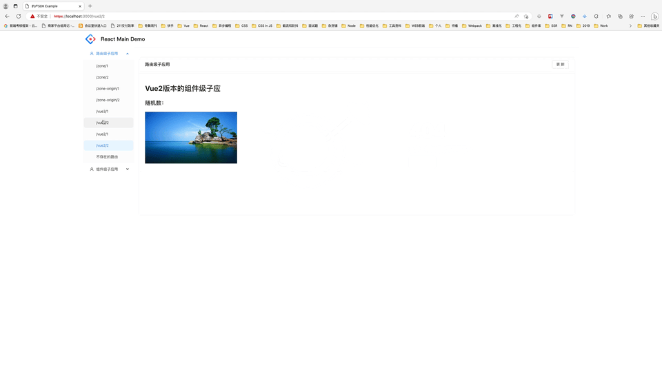

<p align="center">
<!-- ALL-CONTRIBUTORS-BADGE:START - Do not remove or modify this section -->
[](#contributors-)
<!-- ALL-CONTRIBUTORS-BADGE:END -->

  <a href="#">
    
  </a>
</p>

# dilu-sdk

> 的(dí)卢，又作的颅，历史名马，奔跑的速度飞快，背负刘备跳过阔数丈的檀溪，摆脱追兵；

以组件化的方式接入 qiankun(乾坤)微前端框架，支持目前主流的两大技术栈 React 和 Vue，SDK 分别提供了 React、Vue2、Vue3 版本的 SDK；

## 为什么要组件化？

qiankun(乾坤)在 single-spa 的基础上增加了 JS 沙盒环境，提供了 Html Entry 等能力，降低了接入微前端的接入成本；但是我们中后台业务在接入过程中发现，基于 React、Vue 技术栈，按照 qiankun API 的接入，大家的使用姿势各种各样，没有统一的标准，所以我们采用组件化的方式，基于 qiankun 微前端提供的 API 二次封装，提供路由级子应用和组件级子应用的组件，方便大家使用和接入 qiankun，所以 SDK 分别提供了 React、Vue2、Vue3 版本的 SDK；

## SDK 组成

SDK 提供 React 版本和 Vue 版本，详细说明可以参考各独立 SDK 说明

- 主应用 SDK

  - [@ks-dilu/react](./packages/react/README.md)
  - [@ks-dilu/vue](./packages/vue/README.md), 支持 Vue2 和 Vue3

- 子应用 SDK

  - [@ks-dilu/react-micro](./packages/react-micro/README.md)
  - [@ks-dilu/vue-micro](./packages/vue-micro/README.md), 支持 Vue2 和 Vue3

## Examples

在 example 文件夹内，有多个示例应用程序和多个已挂载的 Micro FE 应用程序。要使其运行，请首先克隆 dilu-sdk

```shell
$ git clone git@github.com:Kwai-Eshop/dilu.git
$ cd dilu
```

安装依赖和运行

```shell
$ yarn
# 启动react版本的主应用和所有子应用（react版本、vue2版本、vue3版本）
$ npm run example:react
# 启动vue2版本的主应用和所有子应用（react版本、vue2版本、vue3版本）
$ npm run example:vue2
# 启动vue3版本的主应用和所有子应用（react版本、vue2版本、vue3版本）
$ npm run example:vue3
```

访问 https://localhost:3000/

  

## License

dilu-sdk is [MIT licensed](./LICENSE).

## Contributors ✨

Thanks goes to these wonderful people ([emoji key](https://allcontributors.org/docs/en/emoji-key)):

<!-- ALL-CONTRIBUTORS-LIST:START - Do not remove or modify this section -->
<!-- prettier-ignore-start -->
<!-- markdownlint-disable -->
<table>
  <tbody>
    <tr>
      <td align="center" valign="top" width="14.28%"><a href="https://github.com/ybbjegj"><br /><sub><b>明礼</b></sub></a><br /><a href="https://github.com/ybbjegj/dilu-sdk/commits?author=ybbjegj" title="Code">💻</a></td>
    </tr>
  </tbody>
</table>

<!-- markdownlint-restore -->
<!-- prettier-ignore-end -->

<!-- ALL-CONTRIBUTORS-LIST:END -->
